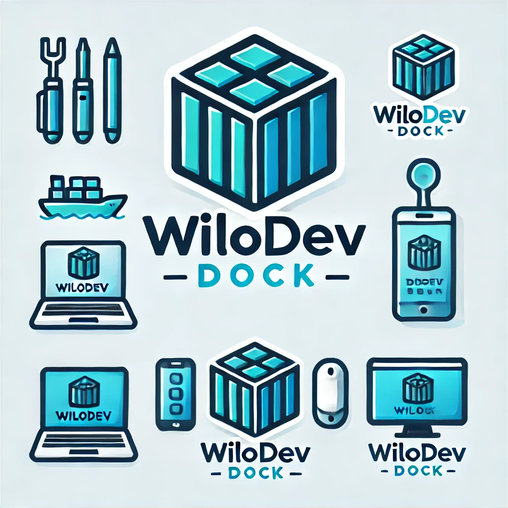
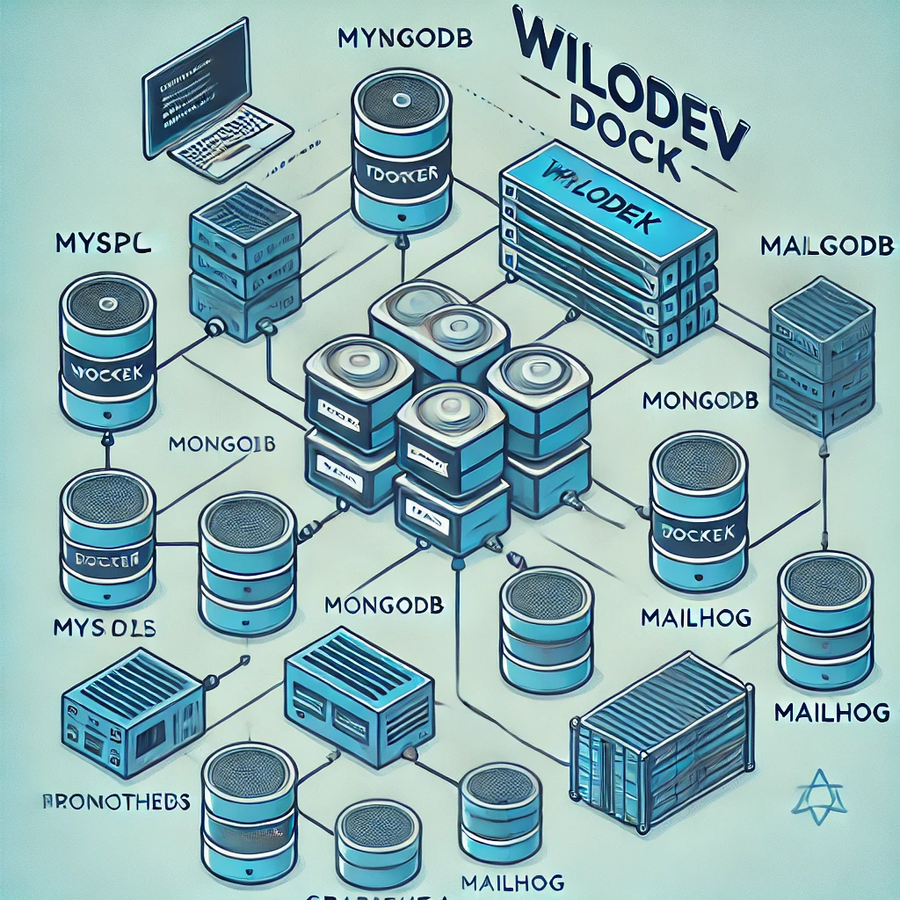
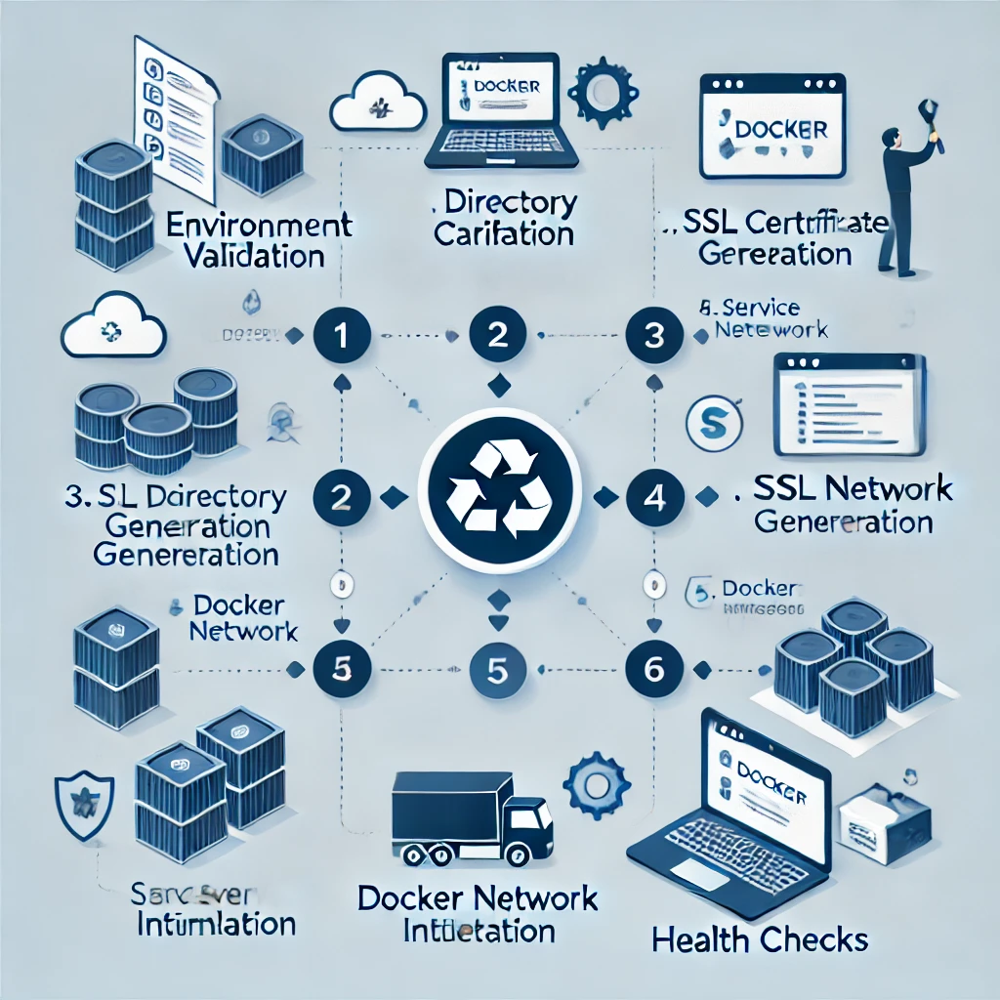

# WiloDev Dock

<p align="center">
  
</p>

## A Complete Containerized Development Environment

[](LICENSE)
[](https://github.com/wilodev/wilodev-dock)
[](https://www.docker.com/)

[English](README.md) | [Español](README.es.md)

## 📋 Overview

WiloDev Dock provides a complete containerized development environment that's ready to use within minutes. It combines powerful tools like Traefik, MySQL, MongoDB, and more to create a developer-friendly setup with robust monitoring capabilities.

<p align="center">
  
</p>

### Core Features

- **Zero Configuration**: Works out of the box with sensible defaults
- **Secure by Default**: HTTPS with auto-generated certificates for local development
- **Performance Monitoring**: Prometheus, Grafana, and Loki integration
- **Database Ready**: Preconfigured MySQL and MongoDB services
- **Mail Testing**: MailHog for capturing and viewing outgoing emails

<p align="center">
  
</p>

## 🚀 Quick Start

### For Linux/Mac Users

```bash
# Clone the repository
git clone https://github.com/wilodev/wilodev-dock.git
cd wilodev-dock

# Copy the environment variables file
cp .env.example .env

# Copy the appropriate setup script for your system
cp setup.linux-mac.example.sh setup.sh
chmod +x setup.sh

# Run the setup script
./setup.sh

# After setup, you can access:
# - Traefik Dashboard: https://traefik.wilodev.localhost (or your configured domain)
# - MailHog: https://mail.wilodev.localhost
# - Prometheus: https://prometheus.wilodev.localhost
# - Grafana: https://grafana.wilodev.localhost (user: admin, pass: admin123)
```

### For Windows Users

```powershell
# Clone the repository
git clone https://github.com/wilodev/wilodev-dock.git
cd wilodev-dock

# Copy the environment variables file
Copy-Item .env.example .env

# Copy the Windows setup script
Copy-Item setup.windows.example.ps1 setup.ps1

# Run the setup script (as Administrator)
# Open PowerShell as Administrator and navigate to the project directory
.\setup.ps1
```

## 📦 Included Services

| Service | Purpose | Default URL |
|---------|---------|-------------|
| **Traefik** | Reverse Proxy & SSL | https://{TRAEFIK_DOMAIN} |
| **MySQL** | Relational Database | localhost:{MYSQL_PORT} |
| **MongoDB** | NoSQL Database | localhost:{MONGO_PORT}|
| **MailHog** | Email Testing | https://{MAILHOG_DOMAIN} |
| **Prometheus** | Metrics Collection |    <https://prometheus.{DOMAIN_BASE}> |
| **Grafana** | Metrics Visualization | <https://grafana.{DOMAIN_BASE}> |
| **Loki** | Log Aggregation | (Internal) |

**Note**: The actual URLs will depend on the values in your `.env` file. The defaults are domain names like `traefik.wilodev.localhost` that point to your local network.

## 📚 Documentation

- [Getting Started Guide](docs/en/getting-started.md)
- [Creating New Projects](docs/en/creating-projects.md)
- [Configuration Reference](docs/en/configuration.md)
- [Troubleshooting](docs/en/troubleshooting.md)
  
These documents are being developed and will be available soon in the docs/ directory.

## 💻 System Requirements

### Linux/Mac

- Bash shell
- Docker Engine 20.10+
- Docker Compose 2.0+
- 5GB free disk space (minimum)
- 4GB RAM (recommended)
- Administrator privileges (for installing mkcert)

### Windows

- Windows 10/11 with PowerShell 5.1+
- Docker Desktop for Windows (with WSL 2 backend)
- 5GB free disk space (minimum)
- 4GB RAM (recommended)
- Administrator privileges (required for hosts file modification)
  
## 🛠️ Supported Development Environments

WiloDev Dock provides pre-configured environments for the following frameworks:

### Laravel

- PHP-FPM with configurable versions
- Nginx optimized for Laravel
- Redis for cache and queues
- Queue worker integration
- Automatic HTTPS configuration with Traefik

### Symfony

- PHP-FPM with specific extensions for Symfony
- Nginx optimized for Symfony's routing system
- Redis for cache and sessions
- Messenger service for asynchronous processing
- Webpack Encore for asset compilation

To create a new project:

### Sección "Creating New Projects" / "Supported Development Environments"

```markdown
To create a new project:

### Linux/Mac

```bash
./create-project.sh
```

### Windows-specific

```powershell
.\create-project.ps1
```

## 📊 Architecture & Flow

WiloDev Dock utilizes a layered architecture for maximum flexibility:

1. **Traefik Layer**: Handles all incoming HTTP/HTTPS traffic, SSL termination, and routing
2. **Service Layer**: Contains your application containers (PHP, Node.js, etc.)
3. **Data Layer**: Provides database services (MySQL, MongoDB)
4. **Utility Layer**: Additional services like MailHog for testing
5. **Observability Layer**: Monitoring with Prometheus, Grafana, and Loki

The setup process follows this sequence:

1. **Environment validation**: Ensures all required tools and configurations are in place
2. **Directory creation and configuration**: Sets up necessary directories and configurations
3. **SSL certificate generation**: Generates self-signed SSL certificates for local development
4. **Docker network creation**: Connects all services together
5. **Service initialization**: Starts all services and performs health checks
6. **Health checks and verification**: Ensures all services are running correctly

<p align="center">
  
</p>

### SSL/HTTPS Management

All external traffic is managed by Traefik through HTTPS (port 443):

1. **Self-generated Certificates**: The `setup.sh` script uses `mkcert` to generate locally-trusted SSL certificates.
2. **SSL Termination at Traefik**: Traefik handles all SSL encryption/decryption.
3. **Internal Communication**: Internally, services communicate through HTTP (port 80) within the Docker network.
4. **HTTPS Scheme Preservation**: `X-Forwarded-*` headers ensure web frameworks correctly detect HTTPS requests.

## 🛠️ Common Use Cases

- **Web Application Development**: Perfect for PHP/Laravel, Node.js and other web frameworks
- **API Development**: Test your APIs with automatic HTTPS and proper domain names
- **Microservices**: Simulate a production-like environment locally
- **Database Development**: Multiple database engines ready to use

## 🔧 Environment Configuration

WiloDev Dock uses environment variables for configuration. Copy the example file to get started:

```bash
cp .env.example .env
```

Key configuration options include:

- **`DOMAIN_BASE`**: Base domain for all services (default: `wilodev.localhost`)
- **`NETWORK_NAME`**: Docker network name (default: `wilodev_network`)
- **`TRAEFIK_DOMAIN`**: Domain for the Traefik dashboard
- **`MYSQL_PORT`, `MONGO_PORT`**: Database ports to expose
- **`TRAEFIK_DASHBOARD_USER`, `TRAEFIK_DASHBOARD_PASSWORD`**: Dashboard credentials

See the `.env.example` file for all available options.

## 📂 Directory Structure

```bash
wilodev-dock/
├── setup.linux-mac.example.sh      # Script config to Linux/Mac
├── setup.windows.example.ps1       # Script config to Windows
├── create-project.example.sh       # Script to create project to Linux/Mac
├── create-project.example.ps1      # Script to create project to Windows
├── docker-compose.yml              # Main service definitions
├── .env                            # Environment configuration
├── setup.sh                        # Setup script
├── traefik/                        # Traefik configuration
│   ├── config/                     # Configuration files
│   │   ├── certs/                  # SSL certificates
│   │   ├── dynamic.yml             # Dynamic configuration
│   │   ├── middleware.yml          # Middleware definitions
│   │   └── traefik.yml             # Static configuration
├── mysql/                          # MySQL configuration
│   └── config/                     # Configuration files
├── mongo/                          # MongoDB configuration
│   └── config/                     # Configuration files
├── projects/                       # Directory for your projects
└── docs/                           # Documentation
```

## 💡 Contributing

Contributions are welcome! Please read our [Contributing Guide](CONTRIBUTING.md) for details.

## Issues and Support

Found a bug or have a feature request? Please [open an issue](https://github.com/wilodev/wilodev-dock/issues/new) on GitHub.

For general questions and discussions, use [GitHub Discussions](https://github.com/wilodev/wilodev-dock/discussions).

## 📄 License

This project is licensed under the MIT License - see the [LICENSE](LICENSE) file for details.

When using this project, please include attribution to the original repository.

## 📚 Acknowledgments

- [Docker](https://www.docker.com/) - Container platform
- [Traefik](https://traefik.io/) - Modern reverse proxy
- [Laravel](https://laravel.com/) - PHP web application framework
- [Symfony](https://symfony.com/) - PHP web application framework
- [MySQL](https://www.mysql.com/) - Relational database management system
- [MongoDB](https://www.mongodb.com/) - NoSQL database
- [MailHog](https://github.com/mailhog/MailHog) - Email testing tool for developers
- [mkcert](https://github.com/FiloSottile/mkcert) - Make locally trusted development certificates
- [WiloDev](https://github.com/wilodev) - Project maintainer
- [Grafana](https://github.com/grafana) - Metrics visualization
- [Loki](https://github.com/grafana/loki) - Log aggregation
- [Prometheus](https://github.com/prometheus/prometheus) - Metrics collection

## 🧑‍💻 Author

- **WiloDev** - [GitHub](https://github.com/wilodev)
